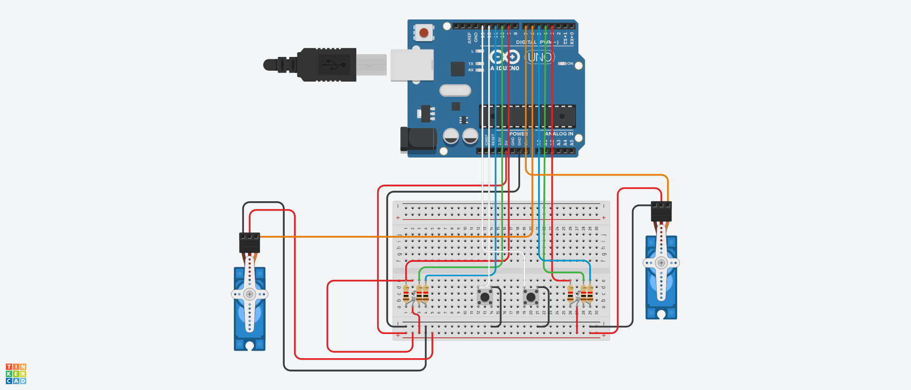

# Deforestation Visualizer

## Description
This Arduino-based project visualizes deforestation data through LEDs, servo motors, and a 3D-printed tree model. Users can simulate the years of deforestation, with the LED colors changing from green (healthy forest) to orange (moderate deforestation) to red (severe deforestation), and the servos shaking the model more intensely as deforestation progresses. When the maximum deforestation threshold is reached, the LEDs turn off, and the servos stop, indicating a completely deforested state.

## Features
- **Interactive Simulation**: Users increase or decrease the simulated years of deforestation using buttons.
- **Deforestation Severity Indication**: LED colors shift based on deforestation severity (Green -> Orange -> Red).
- **3D Printed Tree Model**: A physical tree model provides a visual representation.
- **Servo Movement**: Servos increase shaking with each stage to simulate instability in forest health.

## Project Photos

*Downward view of the Deforestation Visualizer, showing the LEDs and 3D-printed tree model.*

*Side view highlighting the prototype expansion module and wiring setup.*

## Components
- Arduino (e.g., Uno)
- RGB LEDs (common anode)
- 2 Servo Motors
- Push buttons (for incrementing/decrementing years)
- 3D-printed tree model (`model.stl`)
- Breadboard, jumper wires, and resistors (220Ω for LEDs)

## Optional Enhancements
- **Prototype Expansion Module**: Using a prototype expansion module can simplify wiring and help organize components. This module provides additional space and easier access for connecting components, which is especially useful in complex setups.
- **Painting the Tree Model**: For added realism, you can paint the 3D-printed tree model. Consider using a combination of green and brown colors to represent a healthy forest, with gradual touches of orange and red to visually depict deforestation. This enhances the visual impact of the project.

## Setup and Wiring
1. **Circuit Schematic**: See the schematic before for wiring details:
3. **LEDs**: Connect RGB LEDs according to the Arduino pin configuration in the code:
   - **First LED**: Red (9), Green (10), Blue (11)
   - **Second LED**: Red (3), Green (4), Blue (5)
4. **Servo Motors**: Connect servos to pins 6 and 7.
5. **Buttons**: Connect the "increase" button to pin 12 and the "decrease" button to pin 13, with internal pull-up resistors.

## Usage
1. **Upload Code**: Load `DeforestationVisualizer.ino` onto your Arduino.
2. **Run Simulation**: Press the buttons to increase or decrease the simulated deforestation years.
3. **Observe Changes**:
   - As deforestation years increase, LEDs will shift from green to orange to red.
   - Servo shaking intensity will increase with each stage.
   - At the threshold, LEDs will turn off, and servos will stop, indicating complete deforestation.

## Files
- **`DeforestationVisualizer.ino`**: Main code for the Arduino, handling LEDs, servos, and button functionality.
- **`model.stl`**: STL file for 3D printing the tree model.
- **`Schematic.png`**: Circuit schematic for wiring the display, LEDs, servos, and buttons.

## License
This project is open-source and free to use for educational purposes.
